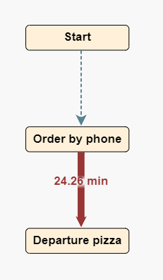
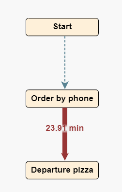

<h1>Treinamento Process Mining</h1>

<h1>Aula 1 - Processos, Importância e Process Mining</h1>
	
Os processos precisam ser fluidos, desse modo temos maior agilidade em sua execução e maior eficácia.

<h2>Processos Falham</h2>
	<ul>
	<li>Processos falham e isso é normal, na área da saúde isso é uma coisa inaceitável pois gera insatisfação imediata, riscos e prejuísos para o cliente.</li>
	<li>Mapeamento de Fluxo de Valor - problemas
			<ul>
				<li>Subjetividade</li>
				<li>Geralmente Mapeia-se apenas o caminho feliz</li>
				<li>Nem todas as pessoas realmente conhecem o processo</li>
				<li>Nem todos querem que os problemas apareçam</li>
				<li>Tempo elevado na observação do processo</li>
			</ul>
		</li>
<h2>o que é Mineração de Processos</h2>

 Na literatura é a ideia de descobrir, monitorar e melhorar processos exrtraindo conhecimento a partir de logs de eventos(dados de processos) disponíveis nos sistemas de informações

O process mining uniu-se com a ciencia de dados para agregar suas práticas à descoberta e monitoação de processos, desse modo podemos aplicar IA, machine-learning, analise preditiva e outras tecnologias inerentes à ciencia de dados aos estudos e algoritmos utilizados pelo process mining

<h2>Definição do Log de Eventos</h2>

O log de eventos reune todos os dados necessários para a analise dos processos a serem analisados, nesse quesito precisamos de alguns dados essenciais, que são:CASE_ID,ACTIVITY e TIMESTAMP. Outros dados podem ser agregados a estes para um maior enriquecimento da analise, porém os três citados anteriormente são essenciais ao processo.

Com os dados já estruturados iniciamos o processo de analise, porém outra necessidade é que precisam ser levados em consideração um grande volume de transações, é recomendado um mínimo de 1000 casos para uma maior profundidade de analise e correta obtenção dos indicadores relacionados.

<h2>Criando um Log de eventos</h2>
<h3>Criando o log de eventos</h3>

CSV FILE 
<table style="border:1px">
<tr>
<td>CASE</td><td>ACTIVITY</td><td>DATE</td>
</tr>
<tr>
<td>hospital_a</td><td>apresentar influenciador</td><td>01/01/2021</td>
</tr>
<tr>
<td>hospital_a</td><td>apresentar decisor</td><td>15/01/2021</td>
</tr>
<tr>
<td>hospital_a</td><td>negociação de preço</td><td>30/01/2021</td>
</tr>
<tr>
<td>hospital_a</td><td>contrato juridico</td><td>28/02/2021</td>
</tr>
<tr>
<td>hospital_a</td><td>fechamento</td><td>30/03/2021</td>
</tr>
<tr>
<td>hospital_b</td><td>apresentar influenciador</td><td>01/01/2021</td>
</tr>
<tr>
<td>hospital_b</td><td>apresentar decisor</td><td>15/01/2021</td>
</tr>
<tr>
<td>hospital_b</td><td>demonstração de valor</td><td>15/02/2021</td>
</tr>
<tr>
<td>hospital_b</td><td>negociação de preço</td><td>28/02/2021</td>
</tr>
<tr>
<td>hospital_b</td><td>contrato jurídico</td><td>28/04/2021</td>
</tr>
</table>
<h3>Sistema</h3>

O sistema conta com templates de carregamento e um padrão para casos genéricos. Cada template destina-se a diferenciar etapas do processo específico tomando como base um 

Após o carregamento precisamos definir o mapeamento da tabela com um "de x para" entre as colunas e os campos da plataforma de modo que possam ser lidos corretamente.

Após o carregamento ser realizado podemos proceder à descoberta de processos, clicando sobre o processo criado e, em seguida, em mapa de processo dentro da opção de Descoberta.

Dentro da descoberta temos várias possibilidades de analise de casos com aplicação de filtros, views alterantivas, mudança de paradigmas de analise e descoberta aprofundada.

<h1>Aula 2</h1>
<h2>Processos Ineficientes Geram Experiencias Ruins</h2>

Um processo ineficiente tende a gerar problemas e afetar a satisfação dos clientes devido á suas consequencias, como demora, retrabalho, falta de organização, descumprimento de prazos, produtos / serviços de má qaulidade, entre outros  Tal problema afeta negativamente a empresa pois gera prejuízos, gastos desnecessários e perda de clientes e reputação.

Avaliemos o caso de uma pizzaria: Um grupo de amigos resolve fazer um pedido online, porém após uma hora ainda noa foi feita a entrega do pedido. Ao entrarem em contato com a pizzaria são informados que repitam o pedido novamente pois o primeiro foi perdido de alguma maneira. Aborrecidos eles refazem o pedido e aguradam a entrega para poderem comer. Quando finalmente é feita a entrega, a pizza já está fria. Espantados com o mau serviço eles fazem uma avaliação negativa da pizzaria e uma crítica em seu site para alertar outros possíveis clientes.

A pizzaria em questão foi inaugurada há cerca de uma no e o neg[ocio costuma ir bem com os clientes elogiando a qualidade e sabor das pizzas. entretanto houve um aumento nas avaliações negativas de clientes e também uma diminuição dos lucros, com prejuízos em algumas entregas. Ao perguntar aos clientes regulares, o dono da pizzaria é informado que em alguns dias a pizza chega perfeitamente, porém em outros demora muito a entrega.

<li style="font-size: 14px; padding: 25px; list-style: none">Nesses casos uma pesquisa de NPS pode ser útil para entender parte das dores e descobrir possiveis problemas no negócio.</li>
<h3>Processo da Pizzaria - Order-to-Cash</h3>

O processo Order to Cash (O2C) é aplicável quando há o recebimento e processamento de pedidos de clientes.

<h2>Pegadas Digitais</h2>

Toda interação, seja ela digitalizado ou não, deixa marcas, no cenário da pizzaria essas pegadas estão nos sistemas de busca, pedidos, gerenciamento e entregas. Nesse caso podem ser transforados em Logs de Eventos. Além dos logs contidos nos sistemas de pedidos e entregas, internamente há o registro das atividades realizadas, as pessoas quem realizaram as atividades e os horários onde as mesmas foram recebidas e entregues, nesse caso realizado de modo manual em uma planilha.  Além desses dados há a notação de dados de satisfação dos clientes, gastos, lucros e toda a sorte de dados adicionais relevantes ao negócio. Todo esse conjunto de dados pode ser tido como um facilitador da analise de processos pois nos permite visualizar de modo geral toda a jornada do processo, desde o inicio até sua conclusão e os desdobramentos de cada atividade em virtude de suas caracterísiticas e demais dados inerentes.

<a style="text-decoration:none; color: black;">Ao realizarmos o carergamento desses logs para a plataforma podemos observar todos os cenários pelos quais o processo seguiu, suas variantes e desdobramentos. Através do processo de descoberta podeos, inclusive, observar que o comportamento mais comum da plataforma é a solicitação via telefone, seguida do pedido no balcão e, por fim, via website. Vemos também que dependendo de cada origem há um comportamento distinto para o inicio da preparacão e consequente sequencia onde, em um dado momento podemos observar um loop-back no processo por telefone com um retorno de chamada.  Também vemos que, em todos os casos analisados, após o ínicio do preparo da pizza eles seguiram o mesmo fluxo (salvo onde houve desistência). NEsse caso todos seguiram para o processo de assar e assim pro diante. Mas podemos notar que durante os processos algumas unidades se perderam, chegando ao final do processo um número inferior de pedidos.   Isso se dá pois limitamos nossa visualização a um cenário ideal, ao abrirmos o range de conexões observamos uma pulverização caótica de rotinas, com caminhos confusos, salto de etapas, loops e diversos outros comportamentos estranhos ao proecsso conforme definido.</a>

Devido a essas possibilidades a ferramneta de descoberta pode agregar tanta qualidade e otimização aos processos, através dela conseguimos identificar as variações e falhas no decorrer do processo. Dentro da ferramenta temos várias possibilidades de análise, são elas:
	<h3>Atividades</h3>
	
São as várias atividades listadas do processo, por ela estabelecemos nosso range de observação do fluxo.

	<h3>Conexões</h3>
	
São o número de variações do processo conforme identificado dentro dos dados carregados, nela definimos qual a profundidade que iremos observar o processo e qual o nível de precisão será exibido, desse modo podemos observar mais ou menos variações.

	<h3>Perspectiva</h3>
	
é a maneira como iremos observar o processo, quais valores iremos apresentar como filtro principais e qual a relação que iremos abordar, se tempo, frequencia, custo, etc.

	
Temos em perspectiva duas opções:
		<ul>
			<li>Primária:
				<ul>
					<li>É definida por qual fator iremos observar das atividades e qual a sua recorrência em virtude da opção selecionada.</li>
				</ul>
			</li>
			 
			<li>Secundária:
				<ul>
					<li>É fator que podemos agregar às variantes e rotinas identificadas, como a relação entre tempo e frequencia, ocorrência e frequencias, entre outros.</li>
				</ul>
			</li>
		</ul>
	

<h3>Filtros</h3>
<h4>Atributos</h4>

Temos, também, a possibilidade de desmembrar as nossas analises através ad ferramenta de filtros, obtendo assim novos valores e medições.    Basta clicarmos no ícone de filtro e selecionar o atributo que iremos levar em consideração para recolhermos nossa métrica, lá podemos selecionar qualquer um dos campos carregados em nosso log de eventos. Desse modo teremos uma segmentação da nossa análise apenas para a condição especificada, desse modo facilitando o entendimento dos dados apresentados e do fluxo como seguiu. Além disso, em casos onde diagnosticamos uma pulverização muito grande de comportamentos, é bastante eficaz para o tratamento individual de cada atributo e seu entendimento mais simplificado.

<h4>Tempo</h4>

No modo tempo podemos segmentar nossos dados em virtude do timestamp do case, assim podemos observar períodos específicos de comportamentos, e ter indicadores levando em consideração sazonalidade, periodicidade e situações adversas temporarias.

<h4>Extremidade</h4>

:/

<h4>Relações</h4>

Como o nome indica, esse filtro permite segmentar as atividades pelas suas relações, criando visualizações de fugas ou aderencia ao processo.

<h4>Ponto de Interesse</h4>

Esse filtro permite segmentar nossa visualização por um dado específico dentro de um range de tempo, desse modo podemos visualizar a tendencia e relacionamentos desse ponto dentro da faixa definida e obter insights direcionados.

<h4>Performance</h4>

Aqui podemos definir a segmentação por resultados gerados, ou seja, a performance do processo. Nesse caso filtramos o conteúdo estabelecendo nossos interesses mínimos e máximos para visualizar os resultados dentro dessa faixa, seja para vermos tudo que atendeu às expectatiavs como para observar melhor aqueles que consideramos tendo fugido dos objetivos esperados.

<h3>Funções dos Filtros</h3>

Através dos filtros podemos gerar visualizações mais assertivas e "limpas" dos processos analisados, de modo que conseguimos estabelecer um melhor entendimento do processo analisado e criar conceitos mais eficazes para sua adequação. Em conjunto a isso temos a possibilidade de combinar os filtros em busca de detalhes antes perdidos entre o log de eventos como, quanto de prejuízo tivemos em decorrência da fuga de alguma etapa do processo ou como uma etapa do processo pode ser removida para agregar maior eficiência e assertividade na execução do fluxo. Isso tudo requer um estudo aprofundado que é favorecido com o uso de segmentações melhor aplicadas.

<h1>Aula 3</h1>
<h2>Extraindo valor dos dados</h2>

Como visto, usando filtros podemos analisar os casos de modo detalhado e direcionado, assim temos detalhes acerca dos indicadores esperados. De maneira direta podemos observar, pelo exemplo da pizzaria, que um pedido com a etapa de Call Customer possui tempo médio de 24.26 min até chegar à etapa de Departure Pizza.   Para isso usamos a segunte combinação de filtros:
	<ul>
		<li>Filtro por Atributo - Selecionado atributo Order by Phone | Usando o parâmetro Casos que Contém</li>
		<li>Filtro por Atributo - Selecionado atributo Call Costumer | Usando o parâmetro Casos que Contém</li>
		<li>Filtro por Atributo - Selecionado Order by Phone e Departure Pizza | Usando o parâmetro Selecionar Somente</li>
	</ul>
	 
Com esse conjunto de filtros chegamos ao seguinte cenário: 

Como pudemos ver, entender e dominar os filtros nos permite identificarmos casos de analise simplificados e com valor agregado, coisa que na visualização crua se torna muito complicada e, por vezes, de difícil cálculo. Ainda seguindo este exemplo, ao alterarmos o cenário para os casos que não contém a etapa Call Costumer o indicador muda ligeiramente, promovendo uma variação na média de tempo que sugere um impacto no processo:  

<h2>Variantes</h2>

As variantes são uma funcionalidade que nos permite realizar a análise das variações pelas quais o processo passou, gerando assim uma visão das fugas do processo. Nela temos uma visão em percentuais das fugas e o total de ocorrências Basta acedermos à página e retirarmos os flgs que poderemos ver todas as fugas apresentadas. Importante: a apresentação das fugas seguirá o filtro aplicado aos dados, ou seja, se tivermos um filtro qeu já exclua as fugas isso impactará na nossa visualização. As flags nos ajudam a segmentar as ocorrências e gerar uma visualização limpa, levando em conta fatores de ordenação e loops, isso porque tais parâmetros são os maiores causadores de impactos no processo mas que, em alguns casos, são inerentes à atividade. Nesse caso as flags de agrupamento de loops une as etapas repetidas em uma unica etapa já o ignorar ordem ignora as variações de ordem trazendo o processo para o layout mais linear possivel.

Expandindo os itens vemos a sequencia relacionada àquele percentual de modo linear, desta forma temos uma visão mais clara de como isso ocorreu, quais etapas ele seguiu, e quais os impactos e ações podem ser aplicadas para a correção daquela fuga específica. junto a isso temos também os totais e médias relacionadas aos itens do log caregado.

Vale ressaltar que as variações podem não ser relacionadas à erros reais no processo e sim à falta de integridade ou completude nos dados. Nesses casos teremos saltos de etapas, fugas devido tempos registrados errados ou loops por lançamentos duplicados.

<h2>Dashboards</h2>

A ferramenta de dashboards é um item à parte, o maior auxílio quanto à visualização da saúde do processo. Nela podemos definir parãmetros apra visualizar os idicadores coletados das analises anteriores de modo mais visual e direto, utilizando para isso gráficos e visualizações dinâmicas, e tendo a possibilidade de nos aprofundar nesses detalhes de maneira mais específica. Os dashboards seguem a lógica das comumente conhecidas "Analises de BI" com a criação personalizada de indicadôres dinâmicos e com as ferramentas mais conhecidas da área, porém com alguma adições interessantes como a possibilidade de integrar o mapa de processos, indicadores de KPI, analises de perfromance e vários outros layouts. Além disso temos várias formas de criar os dashboards com campos específicos ou mesmo filtros pré-aplicados. Para criarmos uma view basta abrirmos a opção componetes, arrastar a view que desejamos criar e na sua configuração aplicar os campos e parâmetros a serem utilizados. Esses campos e parâmertos possuem tanto possibildiades de totalizadores pré-definidos como relacionamentos complexos entre os campos e para isso basta clicar sobre a informaçaõq eu desejamos editar e arrastar o vaLor que iremos utilizar da caixa da caixa Atributos para a acixa Indicadores.  Cada view possui campos específicos porém temos trê campos muito utilizados que são essenciais para a views mais corriqueiras como Colunas, Barras, Pizza, Distribuição Linear e outros. Estes campos são: 
	<ul>
		<li>Indicadores: São os totalizadores queserão utilizados, temos pré-definidos os totalizadores de média, contagem, duração e etc (estes ficam em Negrito></li>
		<li>Dimensões: São os atributos que serão utilizados para calcular o indicador, neste caso temos todos os atributos tal qual contidos em nosso log de eventos.</li>
		<li>Ordenação: Esse define a ordenação a ser aplicada, nesse caso podemos ordenar por atributo ou indicador, em ordem crescente e decrescente.</li>
	</ul>

 
Também podemos habilitar ou não a exportação dos dados contidos nas views marcando a opção de permissão, nesse caso o dashboard irá apresentar um botão para que seja feito o download dessas informações em um arquivo .xlsx. 
Em seguida, após criarmos nossos campos e definirmos os dados a serem analisados pela view, basta aplicar as modificações e, por fim, publicar nosso dash. Todos os dashs, mesmo após publicados, podem ser editados a partir de suas respectivas telas pelo ícone de configurações no canto superior direito da tela. 
Para criarmos um rank ou limitarmos os resultados exibidos pelas views, seja por melhor performance ou geração de indicadores mais eficientes, precisamos sempre limitar os resultados nas configurações da view (isso é uma das boas práticas a serem adotadas para que não tenhamos problemas de proformance). Para criarmos um rank basta usarmos a funcionalidade de limite juntamente com a ordenação, dessa forma criamos um rank seja do maior para menor ou vice e versa, e definimos os itens a partir do número limite.

Ainda no dashboard, a tela de apresentação é ilimitada verticalmente o que permite organizar os itens de maneira mais fluída e responsiva porém traz impactos na performance de carregamento em virtude do tamanho e quantidade de dados e views apresentadas. Em virtude a isso, a única limitação para criação do dashboard é a criatividade, habilidade e performance esperada, podendo dessa forma criarmos um diagnóstico completo do processo em uma única tela.

Por fim, podemos exportar o conteúdo da dashboard em um arquivo .json, isso é importante pois nos permite "clonar" essa view para outros abientes, contato que os dados possuam as mesmas nomenclaturas.

<h1>Aula 4</h1>
<h2>Analise de Conformidade</h2>
<h3>Modelos de Referência</h3>

Em linhas gerais, os modelos de referência são as regras que padronizam o nosso processo e que fiscalizam quando há fugas.

Para criarmos um novo modelo de referência basta irmos ao menú dedicado e criar um novo modelo, mantendo todas as flags ativas clicamos em modelo e, em seguida definimos as etapas e transições esperadas para o processo arastando os respectivos itens para a área de plotagem e definindo as ligações entre cada transição.  Aqui, cada ícone representa uma estrutura do processo, sendo cada uma delas:
	<ul>
		<li>Retângulo: Atividade → é o atributo que iremos definir para a etapa.</li>
		<li>Inicio / Fim → são, respectivamente, onde o processo irá começar e terminar.</li>
		<li>Losango: Paralelo → define uma bifurcação onde o processo irá correr paralelamente.</li>
		<li>Losango: Inclusivo → irá definir quando o processo irá retornar ao fluxo corrente ou se unir à outra linha de processo.</li>
		<li>Losango: Exclusivo → irá definir quando um caminho do processo irá deixar de existir ou ser desqualificado para seguir com o processo.</li>
		<li>Retângulo: Subprocesso → define um processo aninhado ao processo principal, como consequencia ou depêndencia.</li>
	</ul>
 
A partir da configuração do nosso modelo de referência temos as fugas de processo que podem ser observadas pelo painel de conformidade. Lá temos a vizualização das fugas de modo detalhado, com seus percentuais de fuga, variações e demais detalhes acerca da saúde do processo. Além do mais conseguimos auditar essas fugas mais facilmente, observando o fluxo dos processos não conformes.   Também podemos criar múltiplos modelos de referência para analizá-los e compará-los na tela de compliance. Desse modo, quando temos um processo com mais de uma vertente, podemos observar de maneira mais simples, como essas vertentes performam, seus comparativos, proporções e demais analises, o que é útil tanto para observar os processos induvidualmente, analisar melhorias em implementação, ajustar comportamentos nocivos ao processo ou adequação de processos com grande número de variações.

<h3>Compliance</h3>

Dentro da tela de compliance temos diversas opções como o Analise Global, Analise por Caso e o Kanban. Por hora iremos falar a respeito da Analise Global.   Na analise global aplicamos os Modelos de Referência criados aos dados do processo, desse modo vemos em tela os resultados do modelo de referência aplicado, as fugas, variações e erros no processo pré-definido. Aqui temos os indicadores de saúde do processo mais detalhados, com os apontamentos das fugas encontradas, de modo a podermos diagnosticar essas variações facilmente. Ao acedermos á lista de casos em uma fuga e abrirmos o detalhamento de um dos casos podemos ver cada etapa individualmente, com cada etapa separada e o registro da fuga destacado. Essa ferramenta tem uma ótima aplicacão para monitoramento e, tabém, auditoria de processos, pois permite ao auditor, analizar as fugas e tomar ações direcioandas ao problema específico.

<h2>Exercício 1 - Avaliação de Tempos</h2>

 Carregar o log de eventos do Pronto Atendimento em ./src/databases/LogSaude.csv

<ul>
	<li>1. Quantos pacientes deram entrada com sintoma de AVC (I64)? Resposta:  4 casos [true]</li>
	<li>2. Para pacientes com Sintoma de AVC (CID I64) qual o tempo entre as atividades Retirada de Senha e Realização de Tomografia de Crânio? Resposta: 52,33 min
		<ul>
			<li>Quantos casos com sintoma de AVC tiveram tempo maior que 25 minutos entre atividades Retirada de Senha e Realização de Tomografia de Crânio? Resposta: 3</li>
		</ul>
	</li>
	<li>3. Qual o tempo médio entre as atividades de Retirada de Senha até Triagem? Resposta: </li>
	<li>4. Qual o tempo médio entre Triagem e Consulta? Por Nível de Urgência? 32,98</li>
</ul>

Criar um painel com essas avaliações.

<h1>Aula 5</h1>
<h2>Exercício - 2</h2>

Correção dos exercícios propostos e novo exercício.

<ul>
	<li>1. Quantos pacientes deram entrada com sintoma de Dor Torácia (R073 e R074)? Resposta:  37 casos [true]</li>
	<li>2. Para pacientes com Sintoma de Dor Torácia (R073 e R074) qual o tempo entre as atividades Atendimento e Realização de Tomografia de Crânio? Resposta: 52,33 min
		<ul>
			<li>Quantos casos com sintoma de AVC tiveram tempo maior que 10 minutos entre atividades Atendimento e Realização de Eletrocardiograma? Resposta: 25</li>
		</ul>
	</li>
	<li>3. Qual o tempo médio entre as atividades de Atendimento até Triagem? Resposta: 8,38min </li>
	<li>4. Qual o tempo médio entre Atendimento e Consulta? Por Nível de Urgência? 15.78min </li>
</ul>

